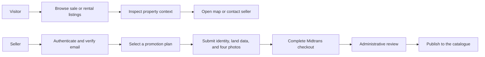
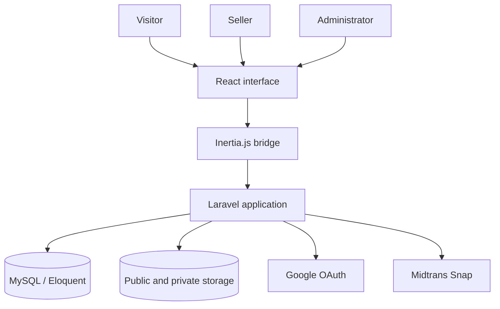

<p align="center">
  
</p>

<h1 align="center">FindLand</h1>

<p align="center">
  <strong>A trust-centered land marketplace for discovery, seller onboarding, payments, and moderated publication.</strong>
</p>

<p align="center">
  <a href="#platform-at-a-glance">Experience</a>
  &nbsp;&middot;&nbsp;
  <a href="#system-design">Architecture</a>
  &nbsp;&middot;&nbsp;
  <a href="#local-development">Local Development</a>
  &nbsp;&middot;&nbsp;
  <a href="#quality">Quality</a>
</p>

<p align="center">
  
  
  
  
  
  
</p>

---

## Overview

FindLand is a full-stack marketplace concept for Indonesian land sales and rentals. It brings the public catalogue, verified seller submissions, promotion packages, Midtrans checkout, and an administrative moderation queue into one coherent Laravel application.

The project is built around a deliberate publication boundary: a seller submits a `LandListing`, completes the associated payment flow, and an administrator reviews the submission before it becomes a public `PropertyListing`.

> [!IMPORTANT]
> FindLand is an active development project, not production-ready brokerage or payment software. A real deployment requires provider credentials, infrastructure configuration, legal review, operational monitoring, and an independent security assessment.

## Platform At A Glance

| Area | What the product supports |
| --- | --- |
| Discovery | Latest and featured properties, sale and rental views, location filtering, catalogue search, pagination, and property detail pages. |
| Property context | Image galleries, pricing, location, land area, certificate type, map links, and direct contact paths. |
| Seller onboarding | Verified accounts, promotion plan selection, identity and contact details, map URLs, supporting documents, four property photos, and terms acceptance. |
| Payments | Midtrans Snap checkout, transaction history, result states, and server-side webhook processing. |
| Moderation | An administrative dashboard, pending review queue, listing enrichment, approval controls, and listing expiry extension. |
| Identity | Registration, sign-in, email verification, password recovery, profile management, and Google OAuth through Laravel Socialite. |

## Experience Model



The visitor journey is optimized for comparison and inspection. The seller journey introduces verification, payment, and moderation before publication so that catalogue records are not created directly from an unreviewed form submission.

## Selected Experiences

<table>
  <tr>
    <td width="50%" align="center">
      
    </td>
    <td width="50%" align="center">
      
    </td>
  </tr>
  <tr>
    <td align="center"><strong>Property-first discovery direction</strong></td>
    <td align="center"><strong>A calm visual identity for land listings</strong></td>
  </tr>
</table>

These images express the product's visual direction. They are conceptual property artwork rather than literal application screenshots.

## System Design

FindLand uses Laravel as the application boundary and Inertia.js to deliver React pages without maintaining a separate public API for the primary browser experience.



### Engineering Highlights

- Separate submission and publication models keep seller intake distinct from the public catalogue.
- Eloquent relationships connect users, packages, land submissions, payments, reviews, and published properties.
- Authentication flows include email verification, recovery, Google OAuth, and explicit session invalidation on account deletion.
- Midtrans server credentials remain server-side, while browser pages receive only the public client configuration they require.
- Inertia page delivery keeps routing and authorization in Laravel while retaining a component-based React interface.
- Skeleton states, Swiper carousels, and reusable components support responsive discovery experiences.
- Metadata, structured data, canonical URLs, and a sitemap route establish an SEO foundation.
- Pest feature tests cover core identity and payment-page boundaries.

## Technology Profile

| Layer | Technology | Role |
| --- | --- | --- |
| Application | PHP 8.2+, Laravel 11.44 | Routing, validation, authorization, persistence, and server rendering. |
| Interface | React 18, Inertia.js 2 | Page composition and the Laravel-to-React navigation boundary. |
| Styling | Tailwind CSS 3 | Responsive layout and visual system utilities. |
| Tooling | Vite 6 | Development server and optimized frontend builds. |
| Data | Eloquent ORM, MySQL | Relational domain persistence and query composition. |
| Identity | Laravel Breeze, Socialite | Session authentication, verification, recovery, and Google OAuth. |
| Payments | Midtrans PHP SDK, Snap | Checkout initiation and transaction notifications. |
| Interaction | Swiper, Framer Motion | Carousels, transitions, and interface feedback. |
| Verification | Pest 3, PHPUnit | Unit and feature-level regression coverage. |

## Repository Map

```text
Findland/
|-- app/
|   |-- Http/Controllers/       Request handling and application workflows
|   |-- Http/Middleware/        Authentication and response boundaries
|   `-- Models/                 Eloquent domain models
|-- bootstrap/app.php           Laravel 11 application composition
|-- config/                     Runtime and provider configuration
|-- database/
|   |-- factories/              Test data builders
|   |-- migrations/             Relational schema history
|   `-- seeders/                Local reference data
|-- public/assets/              Product identity and static media
|-- resources/
|   |-- css/                    Tailwind entrypoint and shared styles
|   |-- js/Components/          Reusable interface components
|   |-- js/Pages/               Inertia page modules
|   `-- views/app.blade.php     Browser document shell
|-- routes/                     Web, authentication, and console routes
`-- tests/                      Pest and PHPUnit verification suites
```

## Local Development

### Prerequisites

- PHP 8.2 or later with the extensions required by Laravel
- Composer 2
- Node.js 20 LTS or later and npm
- MySQL 8 or a compatible MariaDB release
- Provider credentials only for the Google and Midtrans integrations you intend to exercise

### Installation

```bash
git clone https://github.com/AiFahri/Findland.git
cd Findland

composer install
npm ci

cp .env.example .env
php artisan key:generate
```

Configure the database and any external providers in `.env`, then initialize the application:

```bash
php artisan migrate --seed
php artisan storage:link
composer run dev
```

`composer run dev` starts the Laravel server, queue listener, and Vite development process together. The default local application URL is `http://localhost:8000`.

### Configuration

Never commit a populated `.env` file. The checked-in `.env.example` documents the expected keys without carrying deployable credentials.

| Concern | Variables |
| --- | --- |
| Application | `APP_NAME`, `APP_ENV`, `APP_KEY`, `APP_URL` |
| Database | `DB_CONNECTION`, `DB_HOST`, `DB_PORT`, `DB_DATABASE`, `DB_USERNAME`, `DB_PASSWORD` |
| Google OAuth | `GOOGLE_CLIENT_ID`, `GOOGLE_CLIENT_SECRET`, `GOOGLE_REDIRECT_URI` |
| Midtrans | `MIDTRANS_MERCHANT_ID`, `MIDTRANS_CLIENT_KEY`, `MIDTRANS_SERVER_KEY`, `MIDTRANS_IS_PRODUCTION` |
| Redirects | `MIDTRANS_FINISH_REDIRECT_URL`, `MIDTRANS_UNFINISH_REDIRECT_URL`, `MIDTRANS_ERROR_REDIRECT_URL` |
| Analytics | `VITE_GA_MEASUREMENT_ID` |

## Quality

Run the same checks before opening a pull request:

```bash
php artisan test --compact
./vendor/bin/pint --test
npm run build
```

The current engineering baseline has 30 passing tests with 77 assertions. The frontend production build also completes successfully; existing asset-resolution and chunking warnings remain documented development work.

## Security And Operational Boundaries

- Treat identity documents, OAuth credentials, Midtrans server keys, database credentials, and application keys as secrets.
- Keep KTP and other identity documents outside publicly addressable storage in any real deployment.
- Accept final payment state only from a verified Midtrans notification; browser callbacks are user experience signals, not payment authority.
- Place administrative routes behind authenticated authorization checks and production rate limits.
- Configure HTTPS, secure cookies, trusted proxies, backups, retention rules, and centralized monitoring before deployment.
- Review dependency advisories and provider integration guidance before every release.

Please report suspected vulnerabilities privately to the repository maintainers rather than opening a public issue with exploit details.

## Project Status

FindLand is under active development. The repository demonstrates the complete product direction, but production adoption still requires payment-flow hardening, private document storage, authorization review, dependency maintenance, deployment automation, and domain-specific legal validation.

## Contributors

- [AiFahri](https://github.com/AiFahri) - original application, product implementation, and upstream maintenance.
- [ibamzjr](https://github.com/ibamzjr) - engineering hardening, verification, and repository presentation.

## Usage Notice

This repository does not currently include a standalone license file. Public visibility alone does not grant reuse, redistribution, or commercial rights. Contact the maintainers before using the project outside its intended collaboration context.

---

<p align="center">
  <strong>FindLand</strong><br />
  Structured discovery for land, ownership journeys, and trusted publication.
</p>
